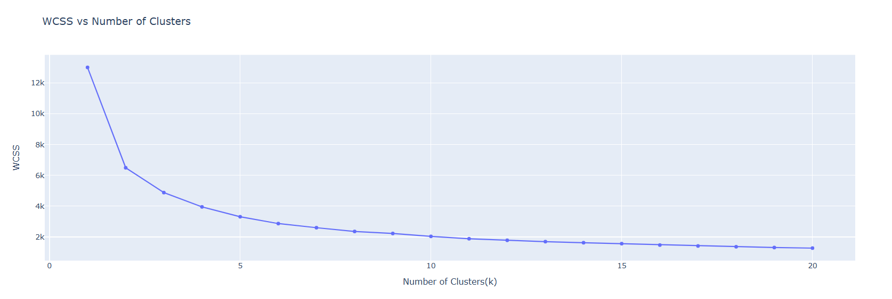
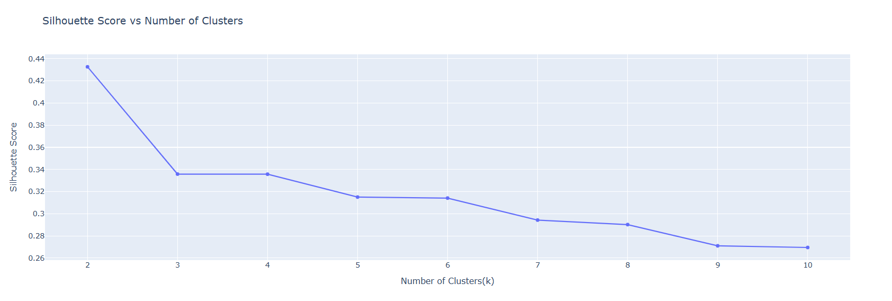
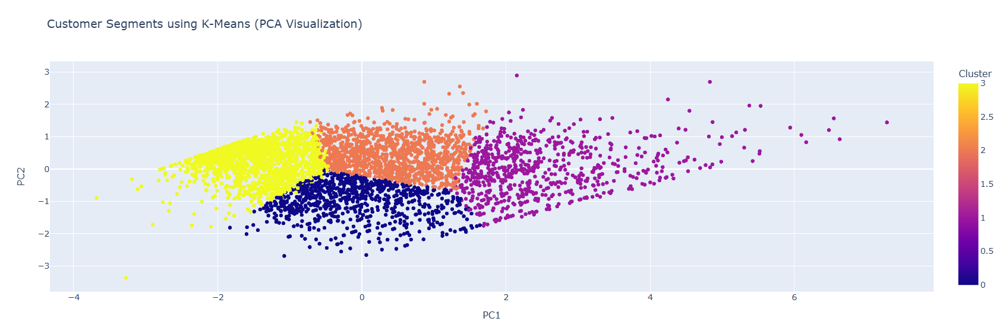
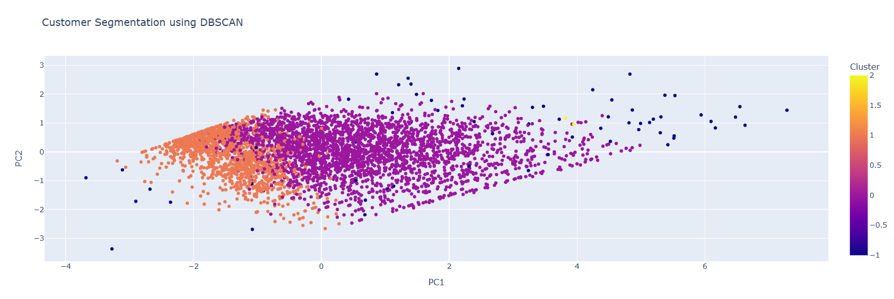

# Customer Segmentation using RFM Analysis and Clustering
## Key Results
- Analyzed 541K+ transactions and created RFM profiles for 4,339 customers
- Compared K-Means, Hierarchical Clustering, and DBSCAN
- K-Means achieved the best performance across all three clustering metrics
- Identified 4 actionable customer segments for targeted engagement and retention strategies
## Project Overview
This project performs customer segmentation using RFM (Recency, Frequency, Monetary) analysis and clustering techniques. K-Means, Hierarchical Clustering, and DBSCAN are compared to identify the most suitable approach for segmenting customers based on purchasing behaviour. The resulting segments are used to develop targeted customer engagement and retention strategies.
## Dataset

- **Dataset:** Online Retail II (UCI Machine Learning Repository)
- **Time Period:** December 2010 – December 2011
- **Transactions:** 541,910
- **Customers:** 4,339
- **Domain:** UK-based online retail
## Objectives
- Transform transaction-level retail data into customer-level RFM features.
- Identify meaningful customer segments using clustering techniques.
- Compare K-Means, Hierarchical Clustering, and DBSCAN using clustering evaluation metrics.
- Select the most suitable clustering approach based on performance and interpretability.
- Develop segment-specific strategies for customer engagement and retention.
## Methodology
1. **Data Cleaning** – Removed invalid transactions and handled missing customer records.
2. **Exploratory Data Analysis** – Examined transaction and customer purchasing patterns.
3. **RFM Analysis** – Created Recency, Frequency, and Monetary features at the customer level.
4. **Feature Preprocessing** – Applied log transformation and standardization to address skewness and scale differences.
5. **Clustering** – Applied K-Means, Hierarchical Clustering, and DBSCAN.
6. **Model Evaluation** – Compared models using Silhouette Score, Davies–Bouldin Index, and Calinski–Harabasz Index.
7. **Segmentation & Recommendations** – Selected K-Means with 4 clusters and developed segment-specific business strategies.
  
### Clustering Model Comparison

| Metric | K-Means | Hierarchical | DBSCAN |
|---|---:|---:|---:|
| Silhouette Score ↑ | **0.34** | 0.28 | 0.21 |
| Davies–Bouldin Index ↓ | **1.01** | 1.13 | 2.02 |
| Calinski–Harabasz Index ↑ | **3313.12** | 2686.36 | 830.95 |

**Result:** K-Means achieved the best performance across all three clustering metrics and was selected with **4 clusters**. Hierarchical clustering also produced 4 clusters, while DBSCAN produced 3 clusters and identified **65 noise points**.
### Model Selection

- **Number of clusters:** 4 clusters were chosen based on the Elbow Method and Silhouette Analysis.
- **Algorithm selection:** K-Means achieved the highest Silhouette Score and Calinski–Harabasz Index, along with the lowest Davies–Bouldin Index among the evaluated models.
## Business Recommendations

- **High-Value Customers:** Reward through loyalty programs and exclusive offers.
- **Regular Customers:** Encourage repeat purchases using personalized recommendations.
- **Inactive Customers:** Re-engage through targeted promotional campaigns.
- **Occasional Customers:** Increase purchase frequency using discounts and offers.
## Technologies Used
* Python
* Pandas
* NumPy
* Matplotlib
* Seaborn
* Plotly
* Scikit-learn
* SciPy

## Project Visualizations

### Elbow Method

### Silhouette Analysis

### K-Means Cluster Visualization

### DBSCAN Cluster Visualization

